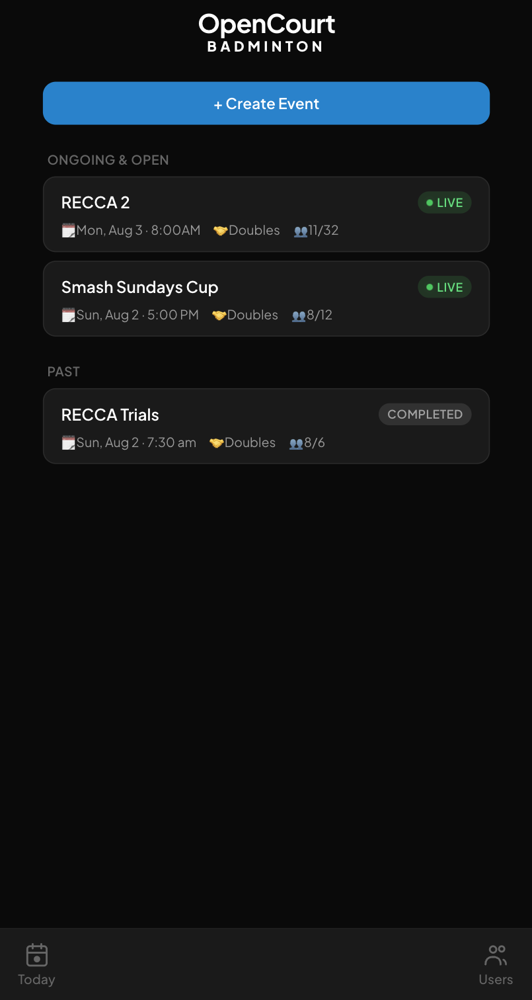
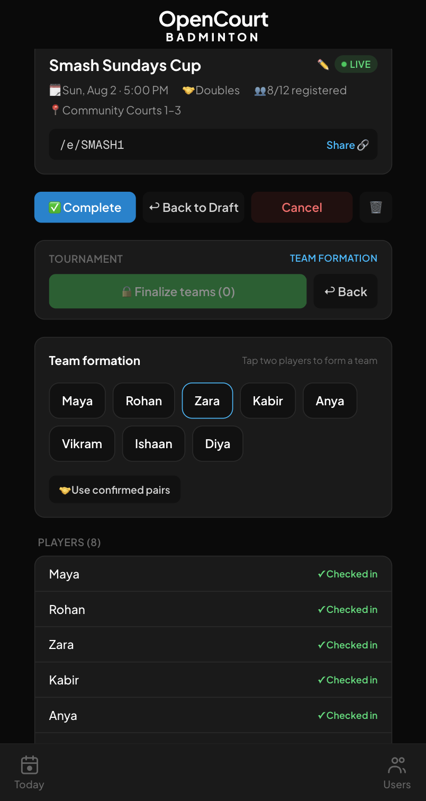
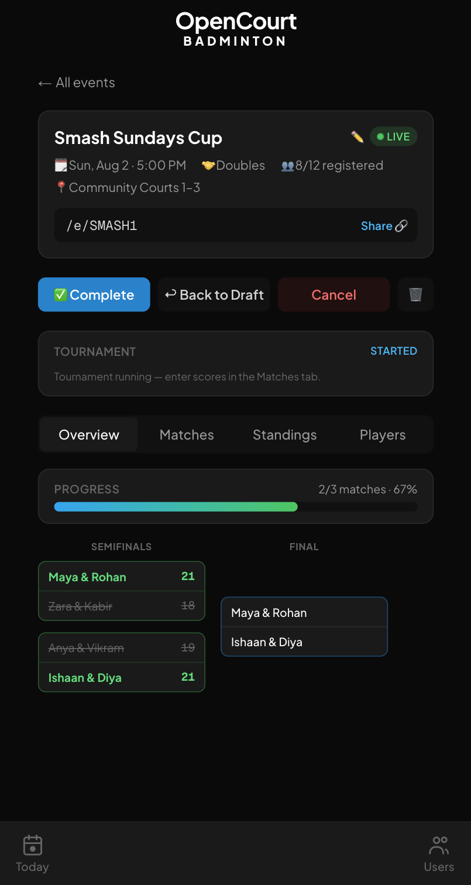
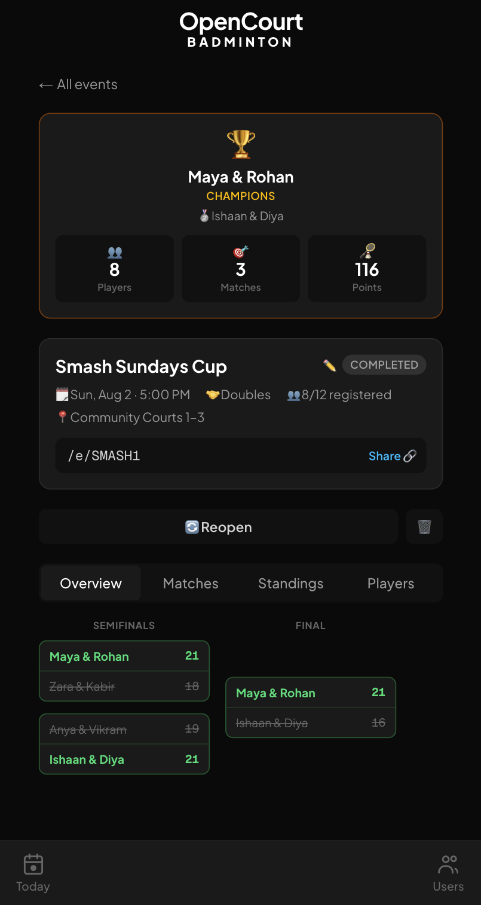

# OpenCourt 🏸

**Club badminton tournaments that don't feel like spreadsheets.**

Create an event, drop the link in your WhatsApp group, watch people register and check in, tap players into teams, pick a format, and run the whole tournament — bracket, scores, standings, champions — from a phone at courtside.

**Live app:** https://opencourt-badminton.vercel.app  
**Landing page:** https://kbrovibes.github.io/opencourt/

---

## The origin story

This app exists because of one WhatsApp conversation between two friends on opposite sides of the planet.

One of us runs a drop-in badminton club in **Snoqualmie, WA** and had already replaced the club's physical whiteboard with an app ([snobaddy](https://github.com/kbrovibes/snobaddy) — sessions, seasons, leaderboards, poems about your win rate, the works). The other plays serious club tournaments in **Chennai, India**, kept meeting genuinely good players across clubs, and had a dream: *friendly inter-club tournaments, with the best pairs from each club going at it.*

The problem? The tournament app everyone in the Chennai circuit uses is… let's quote the actual chat:

> *"I have seen the tournament app they use, it's very basic with ads and player data doesn't persist."*
>
> *"It's very basic da 😀"*
>
> *"Ok this is pretty blah"*

We looked at the alternatives properly:

- **tournamentscheduler.net** — genuinely good at one thing: spin up a schedule fast and share a link. But it's anonymous free-text names. Nothing persists. Next tournament, you're strangers again. ("We were trying to see the players against whom we played last time." You can't.)
- **Universal Badminton Rating (UBR)** — does a *lot*: ladders, check-ins with waitlists, rating-based groupings. But everyone must create and maintain an account before anything works, and for a casual club crowd that's a wall. Not sticky.
- **snobaddy** — nails persistent players, check-ins, and admin ergonomics for a *drop-in club night*… but has no notion of fixed-pair teams or shareable tournament brackets.

Somewhere between tequila, Cabo, and a glass of wine (one of us was hydrating thoroughly during this design review), the conclusion landed: the **casual club player who wants to play real tournaments is underserved**. Kids' circuits get U7-through-U20 events with coaching. Pros get Liquipedia-grade brackets. Club regulars get a URL they'll lose by Tuesday.

So we forked the *spirit* of snobaddy and built OpenCourt.

## What makes it different

| | tournamentscheduler-style | UBR-style | **OpenCourt** |
|---|---|---|---|
| Set up & share in minutes | ✅ | ❌ | ✅ tiny links like `/e/SMASH1` |
| Players persist across tournaments | ❌ | ✅ | ✅ |
| Works when half the crowd won't sign up | ✅ | ❌ | ✅ admins add players in seconds; profiles auto-link when that email eventually logs in |
| Fixed-pair teams | ❌ | partial | ✅ tap-tap team formation |
| Formats that make sense for 6 teams | ❌ | ❌ | ✅ fixed-rounds groups + explicit playoffs |
| Live bracket you'd actually show people | ❌ | ❌ | ✅ |
| Ads | 🙃 | — | never |

The philosophy in one line: **admins do the running, players just show up** — and everything still persists, so next month's tournament starts with this month's people.

## The flow

1. **Create an event** — date, singles/doubles, max players, optional check-in window. It gets a tiny shareable URL for the WhatsApp group.
2. **Register & check in** — players sign in (Google) and register; overflow goes to an automatic waitlist. Admins can bulk-add the "never gonna log in" crowd by pasting names.
3. **Form teams** — tap two players, that's a team. Tap-tap, tap-tap. Confirmed doubles partners can be pulled in with one button. Save the lineup in one shot.
4. **Pick a format** — *Fixed rounds* (everyone plays exactly N group matches — no phantom quarterfinals), *round robin*, *single elimination* (byes go to top seeds, winners auto-advance), or fully *manual*. Benchmarked against how Liquipedia lays out Counter-Strike tournaments, minus the prize pool.
5. **Start & score** — big Start button, courtside score entry, winners flow through the bracket automatically. Group stage done? Two taps generate **top-2 finals or top-4 semis** from live standings.
6. **Crown the champions** — completed events open with a trophy banner, runners-up, and stats. Forever. Because data should persist, da.

## Screenshots

| Events | Team formation | Live bracket | Champions |
|:---:|:---:|:---:|:---:|
|  |  |  |  |

*(It's a PWA — add it to your home screen and it feels like a native app. Light mode exists too, for the brave.)*

## Feature grab-bag

- 📱 Mobile-first PWA, dark & light themes
- 🔗 Tiny share links that survive the login redirect — paste in WhatsApp, tap, land on the event
- 🎽 Player profiles with 1–5 skill ratings (shown only to admins — team formation stays bias-free)
- 🤝 Doubles partner picking with mutual confirmation
- 📋 Waitlists computed automatically from registration order
- 🏟 Multiple simultaneous live events (inter-club dreams need this)
- 🗓 A "Today" tab that jumps straight to the event you're checked into
- 🛡 Admin tools: manual check-ins, bulk player creation, user editing, admin grants, soft-deletes
- 📊 Team standings with points difference, results matrix, and a bracket view

## Tech

Next.js 16 (App Router) · React 19 · Tailwind 4 · Supabase (Postgres + Auth) · Vercel. No ORM, no component library, no ads, no analytics harvesting. Server components read, API routes write, one CSS palette file rules them all.

Run it yourself:

```bash
npm install
cp .env.local.example .env.local   # your Supabase project keys
npm run dev
```

You'll need a Supabase project with the migrations in `supabase/migrations/` applied and Google OAuth configured. Everything else is a `git push` to Vercel.

## Where this is headed

The near-term intent is honest and small: **run it alongside the incumbent app at real Chennai tournaments, next to real courts, and win people over with a working model.** Rating-based group generation, player photos, match highlight reels for the finals, and inter-club "best vs best" events are all on the whiteboard — see `DECISIONS.md` for the running build log.

If you run a club night or a local circuit and any of this resonates: fork it, file an issue, or just steal the ideas. That's why it's public.

---

*Built with rackets in Snoqualmie & Chennai, and an unreasonable amount of Claude Code.* 🤖
